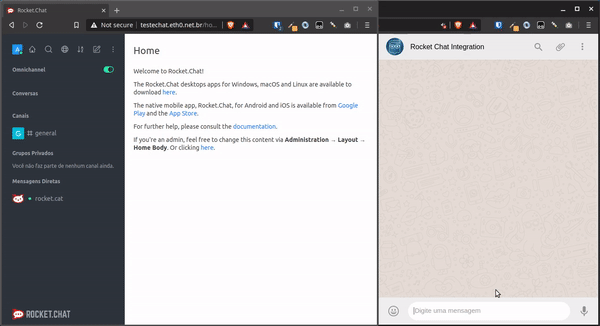

# Rocket.chat integrated with WhatsApp



This service sits between [Rocket.chat](rocket.chat) and [chat-api](chat-api.com).
The goal of this project is to be able to integrate rocket chat and whatsapp seamlessly;
allowing both whatsapp users and rocket.chat users to share images, audio, video and text.
This solution is helpful for companies looking for centralizing their customer support, as
it is very commom to have both a chat widget on the company's website, and users who prefer
to use whatsapp as a customer support channel.

## What this project is not.
This project is not related to an official WhatsApp message broker, nor do I or anyone involved
in this project offer any official message broker service.

## Running this project
To run this project you will need:
- a [chat-api](https://chat-api.com/) account
- a server where you can host the project. A free server such as heroku will do the job.
- a server running [rocket.chat](https://rocket.chat)

Once you have all of the items above, you can edit the constants.py file and add your chat-api
instance number, rocket chat url etc.

Go to your [chat api dashboard](https://app.chat-api.com/dashboard), and under Instance settings,
configure the webhook to ```https://your-domain-name.com/msg_recv```. This is the endpoint that 
awaits for a post message from chat-api, and forwards it to rocket.chat.

Now every message sent to your chat-api whatsapp number should be
forwarded to your rocket.chat live-messages. But the messages sent from rocket-chat will not 
reach your whatsapp number. To solve this, you need to configure rocket.chat's live message
webhooks found under omnichannel > webhooks > send request for agent's messages. 
Your webhook url should look like ```https://your-domain-name.com/msg_snd```.

## TODO:
- [x] Send text messages from WhatApp to Rocket.Chat
- [x] Send text messages from Rocket.chat to WhatsApp
- [x] Send media messages from Rocket.chat to WhatApp (currently only images)
- [x] Send media messages from WhatsApp to Rocket.Chat (media currently goes as links)
- [ ] Integrate with other APIs. (e.g., [Wassenger](https://www.wassenger.com/))

## Want to contribute?
Feel free to open a pull request with a bug fix or a feature you think is interesting.
